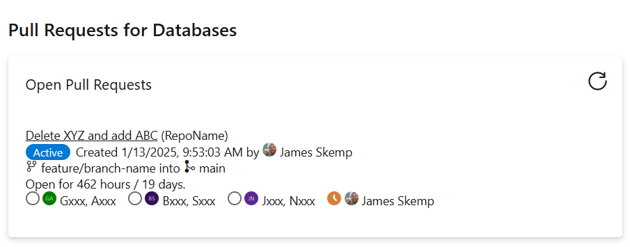
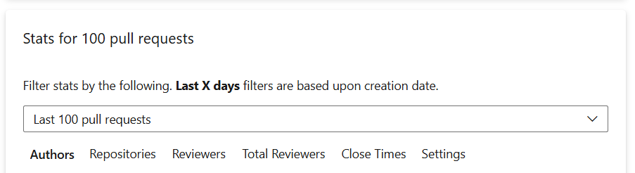
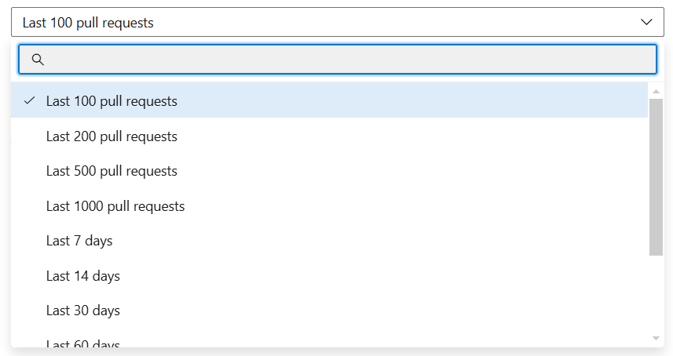
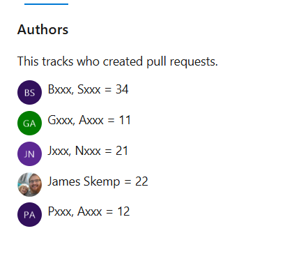
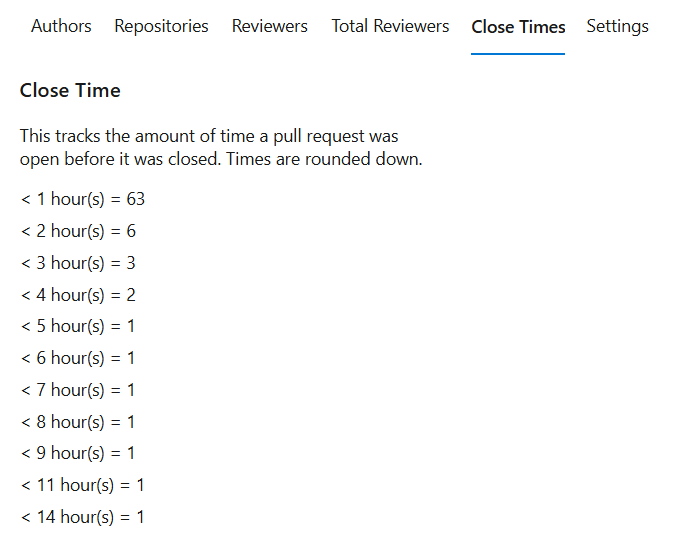
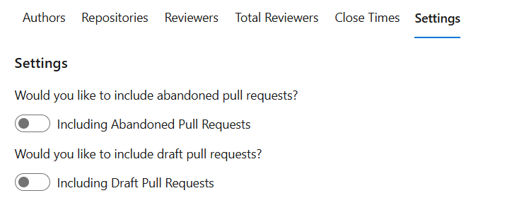

Pull Request Stats supports viewing open pull requests for an entire project and a handful of reports.

It features:
1. Single place to view all open pull requests for all repositories in the current project.
2. Reporting of:
	- Pull request count by:
		- author
		- repository
	- Reporting of how many times an individual reviewed closed pull requests.
	- Reporting of total reviewers on closed pull requests.
	- Reporting of how long pull requests were open before being closed.
3. Multiple options to filter the reporting.
4. Settings to include/exclude abandoned and draft pull requests from reporting.

A partial preview of the reporting filters is shown below. All options include: last 100/200/500/1000 pull requests, last 7/14/30/60/90 days, last year, and all pull requests.

Two example reports are shown below:

Settings are shown below:

